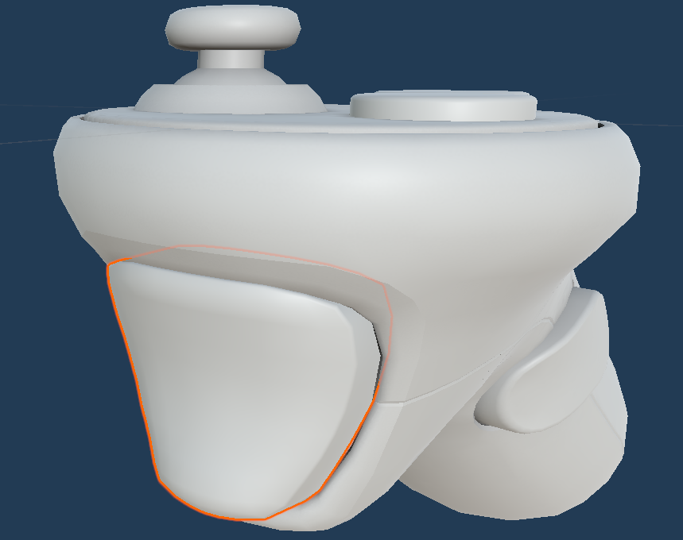

# Unity Client

## Adding features (with menu icon)

- Create a GameObject with the icon representing the function.
- Add a MeshCollider (non-convex), a MeshRenderer (for visibility), and a XRSimpleInteractable (to make it selectable).
- Create a script inheriting from the "Action" class and add it (disabled) to your menu object.
    - In this script, you can override the `OnEnable` function (always calling the parent `OnEnable` method) if you have parameters to initialize.
    - In this script, you must implement the `Begin` function, which will contain the logic for the action (the `step` attribute serves as a counter to track the current step).
- You can add a communication function to the partial class `ClientComm` in the "Client" namespace.

    **Example:**
    Create your new function(s) in a file within the `ClientComm` partial class:
    
    ```csharp
    namespace Client
    {
        public partial class ClientComm
        {
            public async void FunctionComm(parameters1, parameters2)
            {
                // Send a message to the server using 
                await ClientNet.SendMessage("Function", parameters1, ExampleOperation(parameters2), etc...)
                // Receive the server's response through the function
                var response = await clientNet.RecvMessage();
            }
        }
    }
    ```

## Adding actions and linking different buttons

Using Unity's "Input System" and "XR Interaction Toolkit", you can easily add new buttons to perform an action or create custom actions. First, check the available controls for your VR headset model on [Unity's documentation](https://docs.unity3d.com/Packages/com.unity.xr.openxr@1.10/manual/input.html).

Then, you can add your headset in the project settings under __Edit > Project Settings > XR Plug-in Management > OpenXR__, and add your headset profile to the list:

[###Ajout de profi](https://drive.google.com/file/d/1RbFFQmMRAgZHLtS6iPNbCjkMNLoqtfv7/view?usp=drive_link)

Finally, you can modify (and assign new actions to) the mappings for ___Input Actions___. In the __Assets/Actions/__ folder, you can find and add __Input Actions__, which contain __Action Maps__. Each __Action Map__ holds several actions, and each action can be linked to multiple inputs. By specifying the input type (button, Vector2, etc.), you can easily set up new devices and interactions:
<!--- video -->
[###Binding](https://drive.google.com/file/d/1FPZD9gTqS82LNg0Joaxwhpv6sZ9PdPFw/view?usp=drive_link)

## Using the VR Client Interface

First, launch the Rhino plugin server.

Then, start the client from Unity's editor or a build.

## Controller Configuration

For the controllers, we use four main buttons: __PrimaryButton__, __SecondaryButton__, __Grip__, and __Trigger__. These buttons are set up to manage input actions for two types of controllers: the __HTC VIVE__ and the __XR Controller__.

### Primary Button 


### Secondary Button


### Grip


### Trigger


## Commands
### Open VR Menu and Project on a Plane

In the virtual environment, you can open the main menu by pressing the __trigger__ on the __left controller__. While holding the trigger, hover the controller's ray over the desired option, then release the trigger. The option is now selected.

The main action button is the primary button on the left controller (X on Oculus Quest controllers). The secondary button, used to end certain functions (e.g., those requiring an indefinite number of points, like a polyline), is the __grip__ on the __left controller__.

You can project selected points onto a plane using the __trigger__ on the __right controller__. A red plane will appear in the direction of the controller. Planes are positioned at fixed points, and if the controller's ray intersects a mesh triangle, the projection plane aligns with that triangle's normal.

[###Menu VR](https://drive.google.com/file/d/1iMuHPYhMV0UtkuCd-iqXt-MND1mLCsfY/view?usp=drive_link)

### Extrusion and Moving a Vertex

To perform an extrusion, select the corresponding object in the VR menu, then use the controller's ray to choose a face to extrude by pressing the __Primary Button__. To confirm the extrusion, press the same button again.

To move a vertex, select the __MoveVertex__ option in the VR menu. A red sphere will appear on the vertex targeted by the ray, previewing the selection. Start moving the vertex with the __Primary Button__ and confirm the move by pressing the same button again.

[###Move Vertex](https://drive.google.com/file/d/1H4LCaLozKJeHXJGUOiRw5ek8bcHc9jZ_/view?usp=drive_link)

### Moving and Deleting an Object

To move an object, first select the object by clicking the far-left arrow. Then, use the __Primary Button__ to click the object to move. To confirm the move, click the same button again. The object will change color to indicate it has been moved or modified.

To delete an object, click the cross, then use the __Primary Button__ to select the object to delete. The object will disappear immediately.

[###Move & Delete](https://drive.google.com/file/d/14cLRtTlRTvbC-_w79cniaVaKWNwFcgfk/view?usp=drive_link)

### Intersection Between a Box and a Sphere

First, create both objects (a sphere and a box) by selecting the corresponding game object. For the sphere, choose the center and radius. For the box, define the two diagonal points.

To compute the intersection of the two objects, select the game object representing the two converging arrows, then click both objects using the __Primary Button__. The intersection of the two objects will be displayed.

[###Sphere & Intersection](https://drive.google.com/file/d/1RYH-cgUsWPKIStfQ9jmh0NShnYJDaIgk/view?usp=drive_link)

### Merging and Moving the Resulting Object

To merge two objects (e.g., two spheres), click both objects with the __Primary Button__. After merging, they will form a single object. When you move this merged object, the two spheres will move together.

[###Union & Move](https://drive.google.com/file/d/1QgYaYufXKhonTqmt-So3fCvMtU6Rkaao/view?usp=drive_link)


